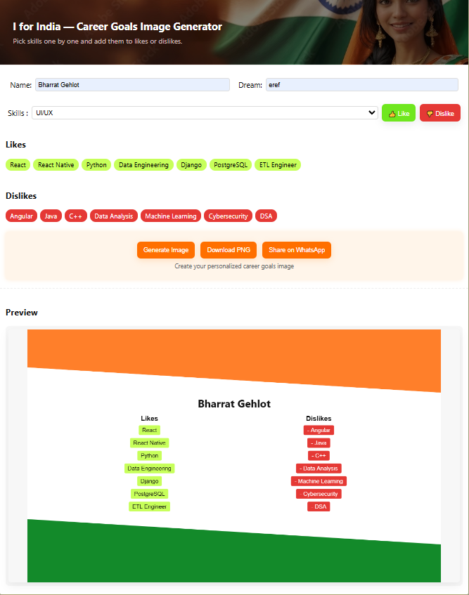

# I for India Project 2025

## Independence Day Career Goals Generator App

### Description
Prepare your likes and dislikes table in computer science to focus on specific goals or languages. This will give you clarity on what you should do, not what you shouldn't.

### Details
Our app helps you create a personalized career roadmap in the field of computer science. By identifying your strengths and weaknesses, you'll be able to make informed decisions about your career path.

### Tech Stacks
HTML, HTML Cnavas, CSS, Javascript and GitHub Pages with custom domain.

### Total Costs
1. 5 Days
2. 126 Rs.

### Screenshots

  
  

---

**Wishing You a Happy 79th Independence Day 2025!**  
**Jai Hind!**

